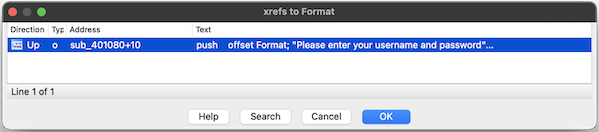
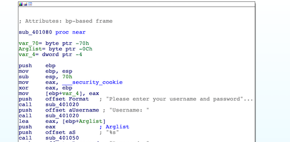
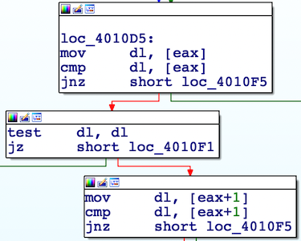
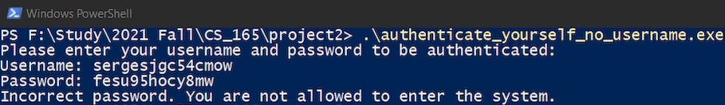
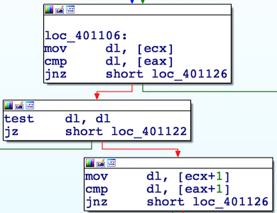

# CS165 Project 2 - Reverse Engineering

Fall 2021 <br> 
Professor Zhiyun Qian <br> 
University of California, Riverside. <br> 

By Sanchit Goel and Jiacheng Hou.

## Part 1 - Authenticate Yourself

In this part, our main goal is to bypass the authentication used in a toy application created for this class and get a unique flag string using the disassembler IDA.

## Program Assessment

### Running the program

Running the program in PowerShell, and entering random strings as username and password, we got:


### Locating the function

To locate the function where the authentication is performed, we searched "username" using the search text function of IDA and found the string 'Please enter your username and password to be authenticated:'.


Then we use "Jump to xref operand..." and saw the string is used in address `sub_401080+10`



And clicking on "OK" brought us to function `sub_401080` and this is the function that performs the authentication.



Now we can work on bypassing the authentication.

## Implementation

### Overview

Here is an overview of the logic of the function:


### Bypassing Username Check

Here is a closer look on how the function checks if the user enters the correct username:


We can see, the function compares the inputted username against the correct username Using a loop. Each loop, it checks if the bytes are the same and if the byte in the inputted username is zero (indication it has reached the end.) [^source]

[^source]: Thanks to John Dvorak at <https://stackoverflow.com/a/13064985> for explaining the combination of `TEST` and `JZ`.

    ```ml
    TEST    EAX, EAX
    JZ      short loc_123456
    ```
    This combo means "jump if `EAX` is zero."

Using "Patch Program" function in IDA, we can edit the program and apply our changes.

To bypass the username check, instead of comparing the byte from the inputted username in `DL` to the byte from the correct username at `addr[ECX]`, we changed it to comparing to itself, which always yields true. 

Similarly, we changed the comparison on the next byte of the username to always be true.

| Before | After |
| :----: | :---: |
|  |  |

By making the changes above, we successfully bypassed the program's username check and the program now always accepts the inputted username. 

After entering a random string as username, we got:



Next was to bypass password check.

### Bypassing Password Check

We found the mechanism for checking password is the same as for checking username, with only some differences:

1. Load the correct password address and inputted password into `EAX` and `ECX` respectively.
2. If the bytes are different, then print incorrect password message.
3. If the end of the inputted password is reached and all its bytes are the same as those of the correct one, the flag string is printed.

We made the similar changes to the comparisons so they would always be true.

| Before | After |
| :----: | :---: |
|  |  |

We successfully bypassed the program's password check as well.

## Outcome

 Since both username and password checks are bypassed, the toy program's entire authentication is bypassed. The program now gives out the flag string no matter what username or password we give.

 Running the patched program with random strings as username and password, we got:

 

The flag is:
            
    34gdfh340234
